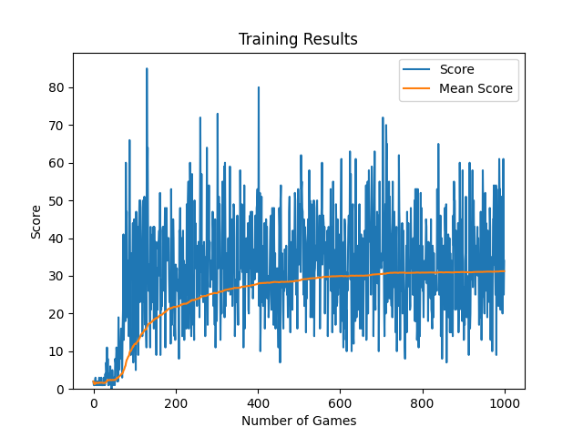
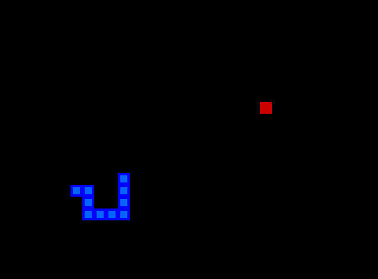

# Snake Game Reinforcement Learning

This was just a fun little project to train a simple reinforcement learning model to play the classic snake game. Basically it's just +10 reward for eating an apple and -10 reward for dying. The game is made with pygame, and I ran 1000 games to see how good the model would get over that time. Here are the training results:

The best score was 85, but it seemed to average at around 35-ish. It started to figure out the zigzag technique at around 400 games or so which was pretty interesting to see.

I might to tetris next hmmmm idk

## Training

Just setup a venv and run `train.py`. You can change `MAX_GAMES` in that file if you wanna train for longer.